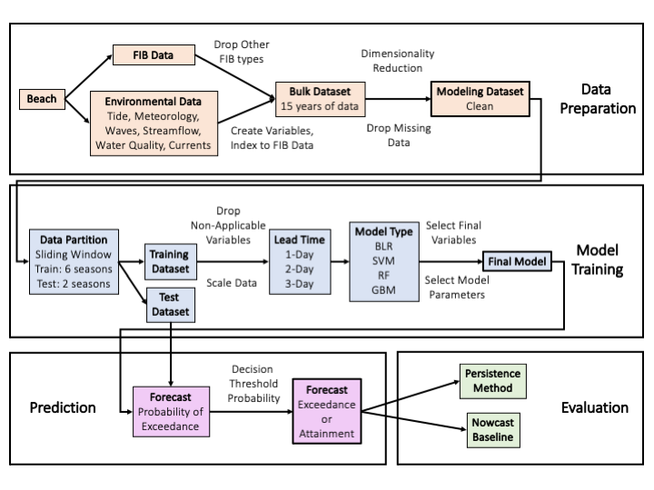

# wq-forecasting
Forecasting fecal indicator bacteria (FIB) at beaches up to three days in advance (Stanford 2022)

Contains python scripts that acquire and process FIB and environmental data, develop forecast models, and evaluate model predictive performance.

Manuscript:

Ryan T. Searcy and Alexandria B. Boehm. **Know Before You Go: Data-Driven Beach Water Quality Forecasting.** *Environmental Science & Technology* (2022). DOI: [10.1021/acs.est.2c05972]((10.1021/acs.est.2c05972)

